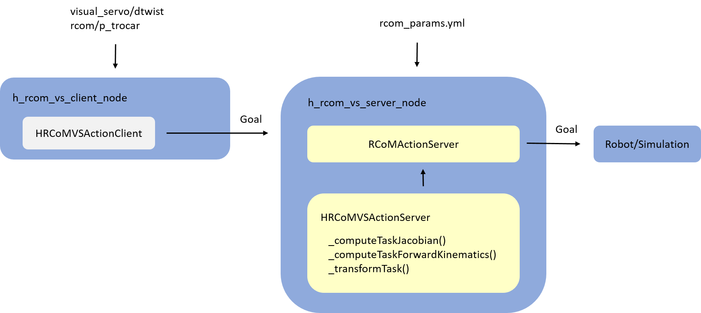

# Homography-based 2D Visual Servoing with Remote Center of Motion
This code implements a [remote center of motion](https://github.com/RViMLab/rcom) with [homography based visual servo](https://github.com/RViMLab/h_vs), see below
<br/>

Two main nodes are provided
- [h_rcom_vs_server_node](src/h_rcom_vs_server_node.cpp) has a [HRCoMVSActionServer](include/h_rcom_vs/h_rcom_vs_action_server.h) that implements a [RCoMActionServer](https://github.com/RViMLab/rcom/blob/master/rcom_impl/include/rcom_impl/rcom_action_server.h) with task functions designed specifically for homography-based control. It sends joint goals to the robot. It reads in parameters from [rcom_params.yml](config/rcom_params.yml)
- [h_rcom_vs_client_node](src/h_rcom_vs_client_node.cpp) has a [HRCoMVSActionClient](include/h_rcom_vs/h_rcom_vs_action_client.h) that sends goals to the [HRCoMVSActionServer](include/h_rcom_vs/h_rcom_vs_action_server.h). It subscribes to `visual_servo/dtwist`, the desired twist velocity in the camera frame, and to `rcom/ptrocar`, the desired trocar position

## Examples
The provided nodes execute any desired homography, as generated from [h_vs](https://github.com/RViMLab/h_vs). Some examples with launch files are explained below.

### Calibration Pattern
This visual servo computes a desired homography from a calibration pattern. To run this example, do
```shell
mkdir -p calibration_pattern_h_rcom_vs/src && cd calibration_pattern_h_rcom_vs/src
git clone --recursive https://github.com/RViMLab/h_rcom_vs_ws && cd ..
catkin_make && source devel/setup.bash
```
In 3 terminals, run
```shell
roslaunch lbr_endoscope_moveit moveit_planning_execution.launch  # initializes robot
```
```shell
roslaunch h_rcom_vs rvom_init.launch  # initializes random endoscope position
```
```shell
roslaunch h_rcom_vs h_rcom_calibratino_pattern_vs.launch  # launches the visual servo
```

### Deep Servos
- different servos with h_gen_node.py, and flags
